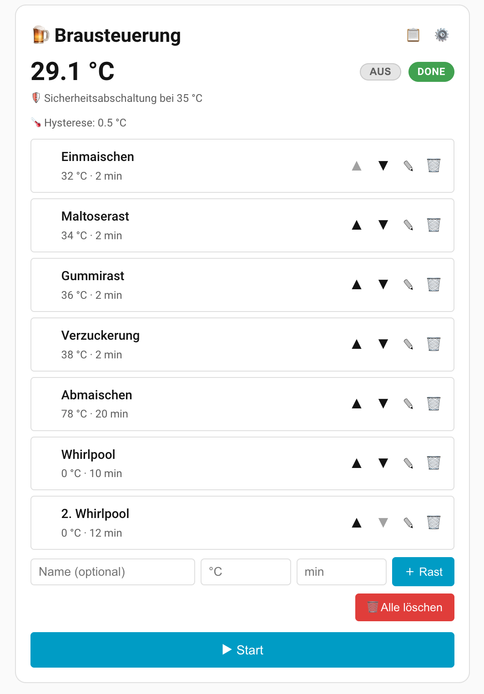

# 🍺 Brausteuerung für Home Assistant

Die Brausteuerung ist eine auf Home Assistant basierende Sudhaus-/Maischesteuerung
für Hobbybrauer. Sie ist für den Betrieb auf einem **Raspberry Pi 4** ausgelegt und
ermöglicht das Erstellen und automatische Abarbeiten von Braurezepten mit mehreren
Raststufen.

Jede Raststufe besteht aus einem Namen, einer Solltemperatur und einer Haltezeit.
Die Steuerung liest die Ist-Temperatur aus einer Home-Assistant-Temperatursensor-
Entität, regelt einen Heizungs-Aktor (Schalter) per Hysterese auf die Solltemperatur
und wechselt nach Ablauf der Haltezeit automatisch zur nächsten Raststufe. Die
Bedienung erfolgt über eine Custom Lovelace Card.

> ⚠️ **Sicherheit zuerst:** Diese Software ersetzt **keinen** unabhängigen
> Hardware-Schutz. Bitte lies vor der Inbetriebnahme den Abschnitt
> [Wichtige Sicherheitshinweise](#-wichtige-sicherheitshinweise).



*So sieht die in Home Assistant eingebundene Brausteuerungs-Card aus.*

---

## Lieferbestandteile

Die Brausteuerung besteht aus den folgenden Dateien:

| Datei | Beschreibung |
|---|---|
| `www/brausteuerung-card.js` | Die Custom Lovelace Card als JavaScript-Modul (LitElement). |
| `www/brausteuerung-logic.js` | Reines Logikmodul, das die Card importiert. **Muss zusammen mit der Card im selben Ordner liegen** (Import `./brausteuerung-logic.js`). |
| `configuration.yaml` | Die benötigten Home-Assistant-Helfer (Single Source of Truth für den Zustand). |
| `automations.yaml` | Die Steuerungslogik als 5 Home-Assistant-Automationen. |
| `README.md` | Diese Installationsanleitung. |

Die 5 Automationen in `automations.yaml`:

| Automation | Aufgabe |
|---|---|
| `brausteuerung_raststufe` | Heizt auf, hält per Hysterese während der Haltezeit, wechselt die Stufe und schließt nach der letzten Rast ab. |
| `brausteuerung_notaus` | Schaltet die Heizung aus und bricht den Timer ab, sobald der Status `running` verlässt (Stop). |
| `brausteuerung_manueller_wechsel` | Durch die Card ausgelöst: bricht den Timer ab und springt zur nächsten Rast bzw. schließt bei der letzten Rast ab. |
| `brausteuerung_uebertemperatur` | Schaltet bei Übertemperatur die Heizung aus, setzt den Status auf `paused` und benachrichtigt. |
| `brausteuerung_komm_verlust` | Schaltet bei Kommunikationsverlust zum Sensor die Heizung aus und benachrichtigt. |

---

## Voraussetzungen

- **Home Assistant** (z. B. auf einem Raspberry Pi 4), mit Zugriff auf die
  Konfigurationsdateien (`configuration.yaml`, `automations.yaml`) und das
  `www/`-Verzeichnis.
- Eine **Temperatursensor-Entität** der Domäne `sensor.*`, die die Ist-Temperatur
  der Maische liefert (z. B. `sensor.ds18b20_maische`).
- Ein **Heizungs-Aktor** der Domäne `switch.*`, der das Heizelement schaltet
  (z. B. `switch.shelly_heizstab`).
- Optional **Node.js** — nur erforderlich, um die mitgelieferten Entwickler-Tests
  lokal auszuführen (siehe [Entwicklung & Tests](#entwicklung--tests)). Für den
  reinen Betrieb der Brausteuerung wird Node.js **nicht** benötigt.

---

## Installation

### 1. Card und Logikmodul kopieren

Kopiere **beide** Dateien in das `www/`-Verzeichnis deiner Home-Assistant-
Konfiguration (`<config>/www/`):

```
<config>/www/brausteuerung-card.js
<config>/www/brausteuerung-logic.js
```

Beide Dateien **müssen im selben Ordner** liegen, da die Card das Logikmodul über
einen relativen Import einbindet:

```javascript
import { ... } from './brausteuerung-logic.js';
```

Liegt `brausteuerung-logic.js` nicht neben der Card, kann der Browser den Import
nicht auflösen und die Karte bleibt leer.

### 2. Als Lovelace-Ressource einbinden

Gehe zu **Einstellungen → Dashboards → Ressourcen → Ressource hinzufügen** und
trage ein:

- **URL:** `/local/brausteuerung-card.js?v=2.2.0`
- **Typ:** `JavaScript-Modul` (`module`)

> Das Verzeichnis `<config>/www/` ist in Home Assistant unter dem URL-Pfad
> `/local/` erreichbar. Das Logikmodul muss **nicht** separat als Ressource
> eingetragen werden — es wird automatisch durch den relativen Import der Card
> nachgeladen.
>
> **Zur Versionsnummer (`?v=…`):** Der angehängte Versions-Parameter sorgt dafür,
> dass der Browser eine neue Card-Version nach einem Update zuverlässig lädt,
> ohne dass der Cache manuell geleert werden muss (siehe Abschnitt
> [Updates](#updates)). Die Version sollte mit der Konstante `VERSION` in
> `brausteuerung-card.js` übereinstimmen (aktuell `2.2.0`).

### 3. Helfer anlegen

Übernimm die Einträge aus `configuration.yaml` in deine Home-Assistant-
Konfiguration. Falls du bereits `input_text`-, `input_select`-, `input_number`-
oder `timer`-Abschnitte hast, füge die Einträge dort ein (Domänenschlüssel nicht
doppeln).

Folgende Helfer werden angelegt:

| Helfer | Domäne | Inhalt |
|---|---|---|
| `brau_rezept_json` | `input_text` | Rezept als JSON-Array (max. 255 Zeichen). |
| `brau_sensor_entity` | `input_text` | Entity-ID des Temperatursensors. |
| `brau_heater_entity` | `input_text` | Entity-ID des Heizungs-Aktors. |
| `brau_status` | `input_select` | Betriebszustand: `idle` / `running` / `paused` / `done`. |
| `brau_aktuelle_stufe` | `input_number` | Index der aktiven Raststufe (0–20). |
| `brau_solltemperatur` | `input_number` | Aktive Solltemperatur in °C (0–100). |
| `brau_sicherheits_offset` | `input_number` | Sicherheits-Offset über der Solltemperatur in °C (0–20). Kein `initial:` (bleibt erhalten); nach Erstinstallation einmalig auf **10** setzen. Fallback in Card/Automation: **10**. |
| `brau_hysterese` | `input_number` | Konfigurierbares Hystereseband unterhalb der Solltemperatur in °C (0,1–5). Kein `initial:` (bleibt erhalten); nach Erstinstallation einmalig auf **1,0** setzen. Fallback in Card/Automation: **1,0**. |
| `brau_raststufe` | `timer` | Haltezeit-Timer der aktiven Raststufe. |

Anschließend **Konfiguration prüfen und neu laden** bzw. Home Assistant neu
starten: **Entwicklerwerkzeuge → YAML → Konfiguration prüfen**, danach die Helfer
(bzw. „Alle YAML-Konfigurationen") neu laden oder Home Assistant neu starten.

> **Persistenz über Neustarts und Updates (wichtig):** Damit die konfigurierten
> Werte — **Sensor, Heizung, das aktuelle Rezept (Rasten), Hysterese und
> Sicherheits-Offset** — auch nach einem **HA-Update oder HA-OS-Update** erhalten
> bleiben, sind diese Helfer **ohne** `initial:`-Attribut definiert. Home
> Assistant stellt ihren letzten Wert dann automatisch wieder her
> (`restore_state`). Ein gesetztes `initial:` würde den Helfer bei **jedem**
> Neustart (und ein Update ist ein Neustart) auf den Initialwert **zurücksetzen** —
> genau das war die Ursache, wenn nach einem Update plötzlich Sensor/Heizung,
> Rasten und Hysterese „leer" waren.
>
> Bewusst **mit** `initial:` (also Reset auf den Ruhezustand bei jedem Neustart)
> bleiben nur die **Laufzeitzustände**: `brau_status` (→ `idle`),
> `brau_aktuelle_stufe` (→ 0), `brau_solltemperatur` (→ 0) und der Timer. So wird
> ein laufender Brauvorgang nach einem Neustart/Update **nicht** unbeaufsichtigt
> fortgesetzt (Sicherheit). Das gespeicherte Rezept und die Bibliothek bleiben
> dabei erhalten und können danach wieder gestartet werden.
>
> **Einmalig nach der Erstinstallation:** Da `brau_sicherheits_offset` und
> `brau_hysterese` kein `initial:` mehr haben, starten sie beim allerersten
> Anlegen auf ihrem Minimalwert (Offset 0 °C bzw. Hysterese 0,1 °C). Stelle den
> **Sicherheits-Offset einmalig auf den gewünschten Wert (Empfehlung 10 °C)** und
> die **Hysterese auf z. B. 1,0 °C** ein — danach bleiben beide Werte dauerhaft
> erhalten. Hinweis: Card und Automation verwenden bei (noch) fehlendem/ungültigem
> Helferwert ohnehin sichere Defaults (Offset **10 °C**, Hysterese **1,0 °C**), der
> Übertemperaturschutz ist also nie unwirksam.

### 4. Automationen hinzufügen

Übernimm die Einträge aus `automations.yaml` in deine Automationen. Die Datei ist
eine YAML-Liste; hänge die 5 Automationen als zusätzliche Listeneinträge an. Lade
anschließend die Automationen neu (**Entwicklerwerkzeuge → YAML → Automationen neu
laden**) oder starte Home Assistant neu.

Die 5 Automationen und ihre Aufgaben sind oben unter
[Lieferbestandteile](#lieferbestandteile) beschrieben.

### 5. Karte zum Dashboard hinzufügen

Füge im Dashboard eine manuelle Karte hinzu (**Karte hinzufügen → Manuell**):

```yaml
type: custom:brausteuerung-card
```

Konfiguriere danach über das ⚙️-Symbol auf der Karte die Entitäten:

1. Klicke auf der Karte auf **⚙️**.
2. Trage im **Sensor**-Feld die Entity-ID deines Temperatursensors ein
   (Domäne `sensor.*`, z. B. `sensor.ds18b20_maische`). Während des Tippens
   werden passende Entitäten vorgeschlagen.
3. Trage im **Heizung**-Feld die Entity-ID deines Heizungs-Aktors ein
   (Domäne `switch.*`, z. B. `switch.shelly_heizstab`).
4. Speichern. Die Auswahl wird persistent in Home Assistant gespeichert.

---

## Updates

**Empfohlenes Vorgehen (kein Cache-Leeren nötig):** Beim Einspielen einer neuen
Version der Card-Dateien die **Versionsnummer hochzählen** — an diesen Stellen,
die identisch gehalten werden müssen:

1. In der Lovelace-Ressource die URL anpassen, z. B. von
   `/local/brausteuerung-card.js?v=2.2.0` auf `?v=2.2.1`
   (**Einstellungen → Dashboards → Ressourcen**).
2. In `www/brausteuerung-card.js` die Konstante `const VERSION = "…"` auf
   denselben Wert setzen. Diese Version wird auch intern an den Import des
   Logikmoduls angehängt (`./brausteuerung-logic.js?v=…`), sodass beim Update
   sowohl die Card als auch das Logikmodul frisch geladen werden.

Da der Browser eine geänderte URL als neue Datei behandelt, werden die
aktualisierten Dateien automatisch geladen — ein manuelles Leeren des
Browser-Caches ist dann **nicht** erforderlich. Nach dem Update das Dashboard
einmal neu laden. Die geladene Version wird zur Kontrolle in der Browser-Konsole
ausgegeben und erscheint im Namen der Karte im Kartenpicker (`Brausteuerung (vX.Y.Z)`).

**Fallback (nur falls doch eine alte Version angezeigt wird):** den Browser-Cache
der Bilder/Dateien leeren. Beispiel für **Microsoft Edge**:

1. Auf **„…"** (Einstellungen und mehr) klicken.
2. **„Browserdaten werden gelöscht"** anklicken.
3. Im erscheinenden Fenster **nur „Zwischengespeicherte Bilder und Dateien"**
   auswählen.
4. Auf **„Jetzt löschen"** klicken.

Danach das Dashboard neu laden. In anderen Browsern (Chrome, Firefox, Safari)
funktioniert das Leeren des Bilder-/Datei-Caches analog; alternativ hilft oft ein
„hartes" Neuladen der Seite (z. B. `Strg`+`F5` bzw. `Cmd`+`Shift`+`R`).

---

## Bedienung

### Rezept / Raststufen anlegen

Gib für jede Raststufe Folgendes ein:

- **Name** — optional. Bleibt das Feld leer, vergibt die Card automatisch den
  Standardnamen `Rast N` (mit `N` = Position der Rast).
- **Solltemperatur** — gültig sind Werte von **0 °C bis 100 °C**.
- **Haltezeit** — gültig sind **ganze Minuten größer als 0**.

Ungültige Eingaben (Solltemperatur außerhalb 0–100 °C, Haltezeit ≤ 0 oder keine
ganze Zahl) werden **nicht** übernommen; das Rezept bleibt unverändert.

Raststufen können vor dem Start über **✎** editiert und über **✕** gelöscht werden.
Über die Pfeiltasten **▲ / ▼** lässt sich die Reihenfolge der Rasten vor dem Start
beliebig ändern; die neue Reihenfolge wird sofort gespeichert. Abgearbeitet werden
die Rasten in genau der Reihenfolge, die beim Drücken von **▶ Start** vorliegt.
Während eines laufenden Prozesses sind Editieren, Löschen und Umsortieren gesperrt.

> **255-Zeichen-Grenze:** Das Rezept wird als JSON-String im Helfer
> `input_text.brau_rezept_json` gespeichert. `input_text` ist auf **255 Zeichen**
> begrenzt. Um möglichst viele Rasten unterzubringen, wird das Rezept in einer
> **kompakten Form** mit kurzen Schlüsseln serialisiert: `n` (Name), `t`
> (Solltemperatur) und `d` (Haltezeit), z. B. `{"n":"Eiweißrast","t":62,"d":15}`
> (ca. 30 Zeichen pro Rast). In der Praxis sind damit ca. **7–9 Rasten** mit
> kurzen Namen möglich. Überschreitet das serialisierte Rezept die Grenze, lehnt
> die Card das Hinzufügen/Speichern ab und das bisher gespeicherte Rezept bleibt
> unverändert. Tipp: kürzere Namen verwenden oder weniger Rasten anlegen.

### Brauprozess steuern

- **▶ Start** — startet mit der ersten Raststufe und setzt den Status auf `running`.
  Start ist nur verfügbar, wenn das Rezept mindestens eine Raststufe enthält **und**
  eine gültige Ist-Temperatur vorliegt.
- **⏹ Stop** — schaltet die Heizung sofort aus und bricht den laufenden Timer ab.
- **⏭ Nächste Rast** — manueller Stufenwechsel: bricht den laufenden Timer ab und
  springt zur nächsten Rast. Auf der letzten Rast wird damit der Brauprozess
  abgeschlossen (Heizung aus, Status `done`, Benachrichtigung).

Während eines laufenden Prozesses zeigt die Karte zusätzlich die **verbleibende
Haltezeit** der aktiven Rast als sekundengenauen Echtzeit-Countdown an.

### Temperaturverlauf-Graph

Unterhalb der Bedienelemente zeigt die Karte einen **Temperaturverlauf-Graphen**.
Dieser bettet die **native Home-Assistant-Verlaufskarte (`history-graph`)** ein und
stellt daher die **echten Verlaufsdaten aus dem HA-Recorder** dar — die
**Ist-Temperatur** des konfigurierten Sensors und die **Solltemperatur in Rot**
(`input_number.brau_solltemperatur`). Über das **„Dauer"-Auswahlfeld** wählst du,
wie viele Stunden angezeigt werden (1–4 h). Details siehe Abschnitt
[Temperaturverlauf / Diagramme](#temperaturverlauf--diagramme).

### Heizungs-Aktor: Anzeige und manuelles Schalten

Sobald ein gültiger Heizungs-Aktor (Domäne `switch.*`) ausgewählt ist, zeigt die
Karte dessen Zustand in Echtzeit neben der Ist-Temperatur an. Ist der Aktor
eingeschaltet, erscheint zusätzlich ein farbiges **🔥 Flammensymbol**.

Der Zustand lässt sich jederzeit über die Anzeige manuell umschalten (AN/AUS).
**Hinweis:** Während eines laufenden Brauprozesses kann die Hysterese-Regelung den
manuell gesetzten Zustand jederzeit gemäß Regelung wieder überschreiben.

### Rezeptverwaltung (Speichern, Laden, Löschen)

Über das **📋-Symbol** in der Kopfzeile öffnest du die Rezeptverwaltung. Dort
kannst du mehrere benannte Braurezepte in einer **Rezept-Bibliothek** ablegen und
wiederverwenden:

- **Speichern unter…** — legt das aktuell in der Karte sichtbare (aktive) Rezept
  unter einem frei wählbaren Namen in der Bibliothek ab. Existiert der Name
  bereits, wird vor dem Überschreiben eine Bestätigung abgefragt.
- **📥 Laden** — lädt ein gespeichertes Rezept als aktives Rezept, sodass es
  bearbeitet oder gestartet werden kann. Während eines laufenden Brauprozesses
  ist das Laden gesperrt.
- **🗑 Löschen** — entfernt ein Rezept aus der Bibliothek.

**Wichtig zur Speicherung:** Die Rezept-Bibliothek wird im **Home-Assistant-
Benutzerspeicher** (`frontend user_data`, Schlüssel `brausteuerung_recipes`)
abgelegt. Das hat zwei Konsequenzen:

- Die Bibliothek ist **benutzerbezogen** — sie ist an deinen Home-Assistant-Login
  gebunden und wird nicht automatisch zwischen verschiedenen HA-Benutzern geteilt.
- Die Bibliothek selbst unterliegt **nicht** der 255-Zeichen-Grenze. Das **aktive
  Rezept** (das gerade gebraut wird) liegt jedoch weiterhin im Helfer
  `input_text.brau_rezept_json` und bleibt damit auf 255 Zeichen begrenzt. Beim
  **Laden** eines sehr großen Rezepts aus der Bibliothek prüft die Karte diese
  Grenze: Passt das Rezept nicht in den aktiven Speicher, wird das Laden mit einem
  Hinweis abgelehnt und das aktive Rezept bleibt unverändert.

---

## Temperaturverlauf / Diagramme

Die Karte bettet die **native Home-Assistant-Verlaufskarte (`history-graph`)**
direkt in die Brausteuerungs-Card ein. Dadurch nutzt der Graph dieselbe
Darstellung wie die eingebauten HA-Diagramme und liest die **echten
Verlaufsdaten aus dem HA-Recorder**:

- **Ist- und Solltemperatur:** Angezeigt werden die **Ist-Temperatur** des
  konfigurierten Sensors und die **Solltemperatur** (`input_number.brau_solltemperatur`).
  Die Solltemperatur wird **in Rot** gezeichnet (`color: "red"`, unterstützt ab
  Home Assistant **2026.6**).
- **Echte Historie aus dem Recorder:** Der Verlauf wird nicht in der Karte
  aufgezeichnet, sondern kommt aus dem HA-Recorder. Er ist dadurch nach einem
  Neuladen, einem Ansichts-/Desktop-Wechsel oder einem Neustart sofort wieder
  vollständig vorhanden und aktualisiert sich live.
- **Fenster beginnt beim Brauvorgang:** Sobald ein Brauvorgang läuft, wird das
  Zeitfenster des Graphen auf den **Startzeitpunkt** begrenzt (`hours_to_show` =
  Zeit seit Start, gedeckelt auf die gewählte Dauer). Dadurch beginnen **beide**
  Linien (Ist-Temperatur und Solltemperatur) beim Brauvorgang; ältere Werte
  liegen außerhalb des Fensters und werden nicht angezeigt — ganz ohne
  Datenbank-Löschung. Läuft der Brauvorgang länger als die gewählte Dauer, wird
  daraus ein normales gleitendes Fenster (1–4 h). Das funktioniert auch, wenn der
  Brauvorgang extern (z. B. per Automation) gestartet wird.
- **Anzeigedauer wählbar (1–4 h):** Über das Auswahlfeld **„Dauer"** im
  Graph-Kopf stellst du `hours_to_show` ein (1, 2, 3 oder 4 Stunden). Die Wahl
  wird **benutzerbezogen** im HA-Benutzerspeicher gespeichert.
- **Beschriftete Achsen:** Achsen (Zeit und Temperatur) werden von der nativen
  HA-Karte beschriftet und skaliert.

> **Voraussetzungen:** Der **Recorder** muss aktiv sein (Standard in Home
> Assistant) und sowohl die Sensor-Entität als auch `input_number.brau_solltemperatur`
> aufzeichnen. Beide werden standardmäßig vom Recorder erfasst; falls du den
> Recorder gefiltert hast (`include`/`exclude`), stelle sicher, dass diese
> Entitäten enthalten sind.

Für eine **dauerhafte** Aufzeichnung über Tage/Wochen (Langzeitstatistik, Zoom)
kannst du ergänzend eine eigene **`statistics-graph`**-Karte ins Dashboard legen,
z. B.:

```yaml
type: statistics-graph
entities:
  - sensor.ds18b20_maische
days_to_show: 0.1
period: 1minute
chart_type: line
stat_types:
  - mean
```

---

## Regelung & Sicherheit

### Hysterese-Band (konfigurierbar, Default 1,0 °C)

Während der Haltephase regelt die Steuerung die Ist-Temperatur mit einem
konfigurierbaren Hystereseband unterhalb der Solltemperatur:

- Ist-Temperatur **< Soll − Hysterese** → Heizung **AN**
- Ist-Temperatur **≥ Soll** → Heizung **AUS**
- Ist-Temperatur **im Band** (Soll − Hysterese ≤ Ist < Soll) → Zustand bleibt
  unverändert

Das Hystereseband lässt sich über die Card (⚙️-Einstellungen) einstellen. Gültig
sind Werte **größer als 0 °C bis maximal 5 °C**; der Standardwert ist **1,0 °C**.
Der Wert wird im Helfer `input_number.brau_hysterese` persistent gespeichert und
das aktuell geltende Band wird auf der Karte angezeigt. Bei fehlendem oder
ungültigem Wert verwendet die Steuerung den Default von 1,0 °C.

### Sicherheits-Offset und Übertemperaturschutz

Der Helfer `input_number.brau_sicherheits_offset` (Default **10 °C**) definiert den
Abstand oberhalb der Solltemperatur, ab dem eine Übertemperatur erkannt wird. Er
ist über die Card bzw. die Home-Assistant-Oberfläche konfigurierbar. Der
**Sicherheitsschwellwert** berechnet sich als:

```
Schwellwert = Solltemperatur + Sicherheits-Offset
```

Beispiel: Bei einer Solltemperatur von 67 °C und dem Default-Offset von 10 °C
liegt die Sicherheitsabschaltung bei 77 °C.

Dieser Schwellwert wird auf der Karte angezeigt. Überschreitet die Ist-Temperatur
den Schwellwert, schaltet die Automation `brausteuerung_uebertemperatur` die
Heizung sofort aus, setzt den Status auf `paused` (wodurch die Regelschleifen
terminieren) und erzeugt eine Benachrichtigung. Die Fortsetzung erfordert eine
bewusste Benutzeraktion.

### Sensor-Offset (Kalibrierung) — in Home Assistant

Ein **Sensor-Offset** zur Kalibrierung der Ist-Temperatur (z. B. wenn der
Temperaturfühler systematisch 1–2 °C zu hoch oder zu niedrig misst) wird
**nicht** in der Brausteuerung selbst, sondern direkt in **Home Assistant**
vorgenommen. Die Card liest den Sensorwert unverändert aus der gewählten
Entität.

Empfohlenes Vorgehen: einen Helfer bzw. eine abgeleitete Sensor-Entität in HA
anlegen, die den Rohwert um den Offset korrigiert, und diese korrigierte Entität
anschließend in der Card als Temperatursensor auswählen. Beispiele:

- Über **Einstellungen → Geräte & Dienste → Helfer** einen passenden Helfer
  anlegen, oder
- einen **Template-Sensor** in `configuration.yaml` definieren, z. B.:

  ```yaml
  template:
    - sensor:
        - name: "Maische Temperatur (kalibriert)"
          unit_of_measurement: "°C"
          state: "{{ states('sensor.ds18b20_maische') | float(0) + 0.5 }}"
  ```

  Den so erzeugten Sensor (`sensor.maische_temperatur_kalibriert`) dann in der
  Card im **Sensor**-Feld auswählen.

### Kommunikationsverlust

Liefert die konfigurierte Sensor-Entität während eines laufenden Prozesses
(`running`) für eine definierte Dauer den Wert `unavailable` oder `unknown`,
schaltet die Automation `brausteuerung_komm_verlust` die Heizung aus, setzt den
Status auf `paused` und erzeugt eine Benachrichtigung. So wird der Brauprozess
angehalten, statt mit ungültigen Sensordaten weiterzuregeln, und unkontrolliertes
Aufheizen ohne gültigen Messwert verhindert.

Die Toleranzdauer ist über die Konstante **`KOMM_VERLUST_DAUER` (Default 30 s)**
festgelegt. Kurze Aussetzer lösen also nicht aus. Soll die Dauer angepasst werden,
ist ausschließlich der `for: { seconds: 30 }`-Wert im Trigger der Automation
`brausteuerung_komm_verlust` in `automations.yaml` zu ändern.

---

## ⚠️ Wichtige Sicherheitshinweise

Die Brausteuerung steuert reale Hardware mit hohen Temperaturen. Die folgenden
Hinweise sind **zwingend** zu beachten:

- **Unabhängiger Hardware-Übertemperaturschutz (erforderlich):** Zusätzlich zur
  Software-Überwachung ist ein vom System **unabhängiger** Hardware-
  Übertemperaturschutz (z. B. ein mechanischer Temperaturbegrenzer / STB) zu
  verwenden. Er muss unabhängig von Home Assistant, der Sensor-Entität und den
  Automationen wirken.
- **Physische Abschaltbarkeit bei HA-Ausfall (erforderlich):** Der Heizungs-Aktor
  **muss** bei einem Ausfall von Home Assistant physisch abschalten können. Wähle
  einen Aktor, der im stromlosen bzw. nicht angesteuerten Zustand öffnet
  (Heizung aus), sodass ein Software- oder Verbindungsausfall nicht zu
  unkontrolliertem Heizen führt.
- Betreibe die Anlage **nie unbeaufsichtigt**.

---

## Entwicklung & Tests

Die reine Card-Logik (`www/brausteuerung-logic.js`) ist mit
[Vitest](https://vitest.dev/) und Property-Tests via
[fast-check](https://github.com/dubzzz/fast-check) abgedeckt. Für die
Ausführung der Tests ist **Node.js erforderlich**.

```bash
# Abhängigkeiten installieren
npm install

# Tests einmalig ausführen
npm run test:run
```

Die Tests prüfen u. a. Rezept-Validierung, Serialisierung (255-Zeichen-Grenze),
die Hysterese-Schaltlogik und die Sicherheitsinvariante (Heizung aus bei Gefahr).
Für den Betrieb der Brausteuerung in Home Assistant sind diese Schritte **nicht**
notwendig.
